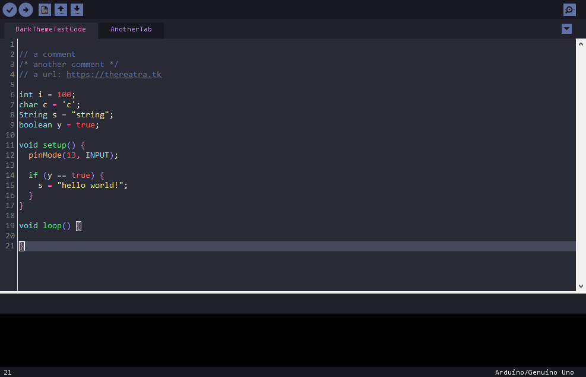

# arduinoDracula
A [Dracula](https://draculatheme.com/) inspired theme for the Arduino IDE.  
Tested for compatibility with version 1.8.8

## Installation
To install the theme go to the `lib` folder in your Arduino installation folder, if it's installed at the default location it can be found at:

* Mac `~/Applications/Arduino.app/Contents/Java/lib`
* Windows `C:\Program Files (x86)\Arduino\lib`
* Linux `/usr/share/arduino/lib/`

Replace the `theme` folder.  
I've also provided `themeOriginal` in case you want to revert back to the original theme.

**Optional!**  
There's some extra optional subjective minor tweaks provided in the `preferences.txt` file. These can be installed by opening the preferences of the Arduino IDE and clicking "more preferences can be edited directly in the file" at the bottom.  
Replace the `preferences.txt` then open it and go to the # SOFTWARE SETTINGS section and replace the username in  `C:\Users\username\Documents\Arduino` with your username.